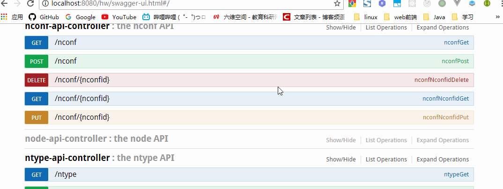
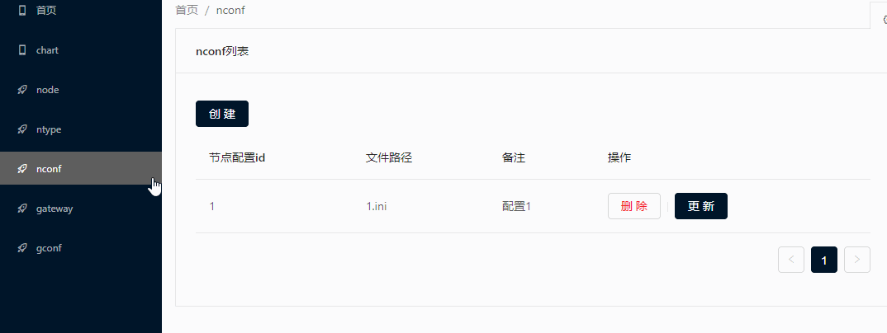
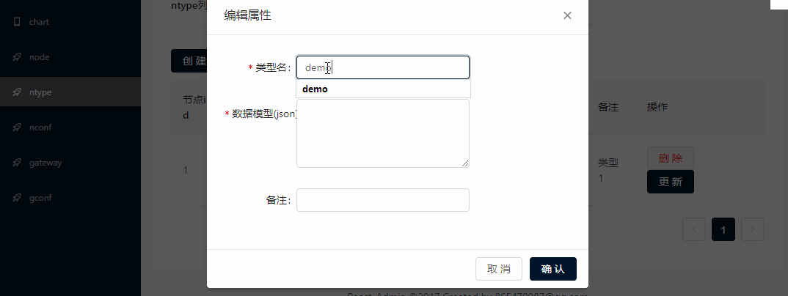
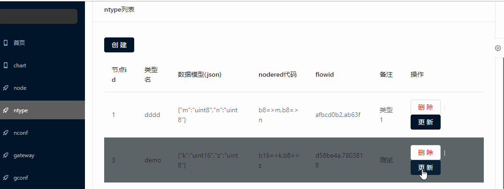
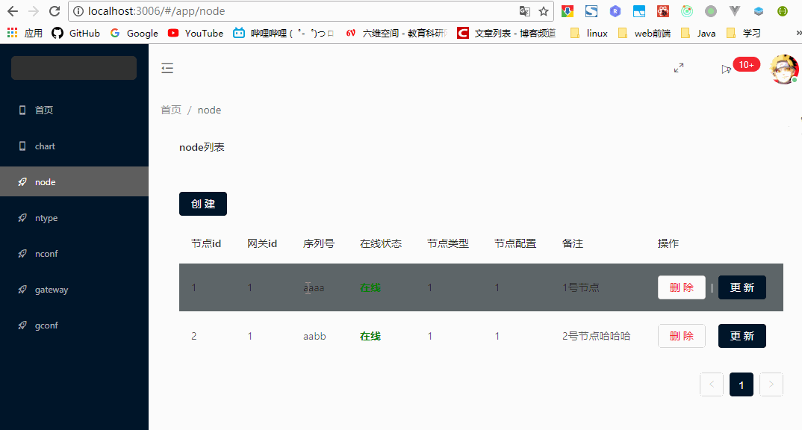

# 一、硬件管理--增删改查
## Rest接口
较为完善的swaggerUI

## 界面操作

# 二、数据模型解析
## 自动配置模型解析
目前支持的类型有uintX,intX,floatX (X为1,2,4,8,16,32,64)，可以转换为packet包的解析字符串。  

## 修改和删除也自动关联NodeRed

# 三、实时折线图自动生成
目前支持数字类型的数据的实时折线图自动生成，不需要写任何代码,只要指定节点的数据模型即可。其生成依据是上面配置的数据模型，首先根据节点的信息获取mqtt应该订阅的topic，然后拿到的数据按照数据模型，生成相应的折线图。  
